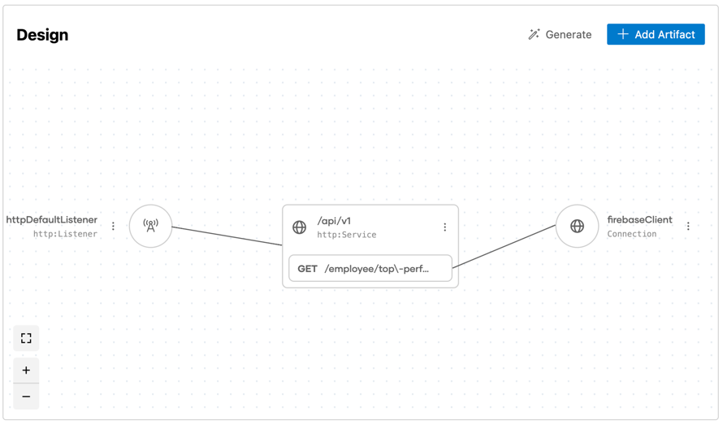
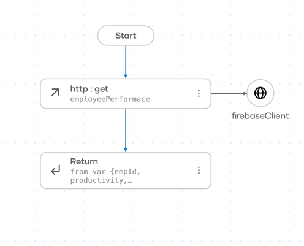
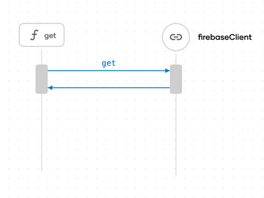

# Integration with Pipes and Filters Pattern Using Ballerina Integrator

## Overview

This integration demonstrates the **Pipes and Filters** pattern, where a large processing task is divided into smaller, independent steps (filters). These filters are connected by channels (pipes), and data flows through the pipeline, undergoing transformations at each stage. This integration is built using **Ballerina Integrator (BI)** to showcase the ease of implementing such patterns within a low-code integration environment.
For more detailed information on the **Pipes and Filters** pattern, visit the [Pipes and Filters documentation](https://www.enterpriseintegrationpatterns.com/patterns/messaging/PipesAndFilters.html).

## Design View

The **Design View** visualizes the overall system structure. It shows how different components (filters) are connected through pipes, demonstrating the data flow and interaction between the independent processing steps in the pipeline.



## Integration Flow



## Sequence Diagram



## Steps to Open with Ballerina Integrator (BI)

Follow these steps to open the project and start working with the **Pipes and Filters** integration using **Ballerina Integrator (BI)** in **VSCode**:

1. **Clone the Repository:**
   Clone the repository to your local machine by running the following command:
   ```bash
   git clone https://github.com/wso2/docs-bi.git

2. Open VSCode.
3. Once VSCode is opened, go to File > Open Folder....
4. Navigate to the directory where you cloned the repository.
5. Select the project folder and open it.
